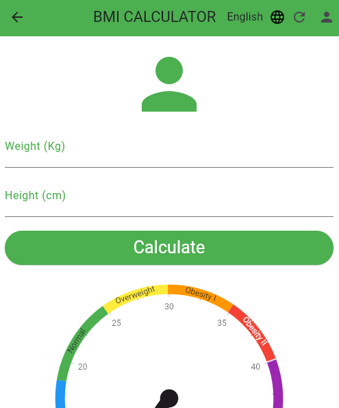

# bmi
# BMI Tracker App 📊

A multi-language Flutter application for calculating and tracking BMI metrics with Firebase integration.

 <!-- Replace with actual screenshot collage -->

## Features ✨
- **BMI Calculation**: Instant BMI computation using weight/height inputs
- **Multi-language Support**: English/French/Arabic localization
- **Firebase Integration**:
  - User authentication (Login/Register)
  - Cloud Firestore for BMI history storage
- **History Tracking**: View previous BMI measurements with timestamps
- **User Profile**: Email display and quick access to history
- **Responsive UI**: Adaptive layout for various screen sizes

## Prerequisites 📋
- **Dart SDK** (>=2.19.6)
- **Flutter Framework** (>=3.7.0)
- **Android Studio** (or VS Code with Flutter extension)
- **Git Version Control**
- **Firebase Account** (for backend services)

## Installation 🛠️

### Firebase Setup
1. Create Firebase project at [console.firebase.google.com](https://console.firebase.google.com/)
2. Enable Authentication (Email/Password) and Firestore Database
3. Add Android/iOS apps and download `google-services.json`/`GoogleService-Info.plist`
4. Place config files in respective platform folders

### Local Setup

#git clone https://github.com/your-username/bmi_tracker_app.git
#cd bmi_tracker_app
#flutter pub get
#flutter run

## Project Structure 📂
bmi_tracker_app/
├── android/
├── ios/
├── lib/
│   ├── firebase_options.dart        # Firebase config (auto-generated)
│   ├── main.dart                    # Main app entry point
│   ├── auth_service.dart            # Auth logic (login, register, logout)
│
│   ├── models/
│   │   └── bmi_record.dart          # BMI record model (optional if needed)
│
│   ├── screens/
│   │   ├── login_page.dart          # Login UI
│   │   ├── register_page.dart       # Register UI
│   │   ├── home_page.dart           # Main BMI calculator
│   │   ├── history_page.dart        # BMI history list
│   │   └── profile_page.dart        # Profile page with logout, history link
│
│   ├── widgets/
│   │   └── language_selector.dart   # Dropdown for language change
│
│   ├── l10n/
│   │   ├── app_en.arb               # English translations
│   │   ├── app_fr.arb               # French translations
│   │   ├── app_ar.arb               # Arabic translations
│   │   └── app_localizations.dart   # Generated file by Flutter intl
│
│   └── utils/
│       └── bmi_utils.dart           # BMI calculation helper functions (optional)
│
├── test/
│   └── widget_test.dart             # Default widget test (can add more)
│
├── pubspec.yaml                     # Dependencies and assets
├── pubspec.lock                     # Locked dependencies
├── README.md                        # Project description and setup
├── .gitignore                       # Ignore build/.dart_tool/etc.
├── .metadata
├── analysis_options.yaml            # Linting rules (optional)
└── .vscode/ or .idea/               # Editor-specific configs (optional)

## Usage 🚀
  1-Registration: Create new account via Register screen
  2-BMI Calculation:
    **Enter weight (kg) and height (cm)**
    **Tap "Calculate" to get BMI result**
  3-History Tracking:
    **View previous calculations with dates**
    **BMI categories indicated by color coding**
  4-Language Switching:
    **Use dropdown to select preferred language**

## Development Commands 💻
# Run in debug mode
flutter run

# Generate localization files
flutter gen-l10n

# Run tests
flutter test

# Build APK
flutter build apk --release
## BMI Diagramme de sequence

## Screens

